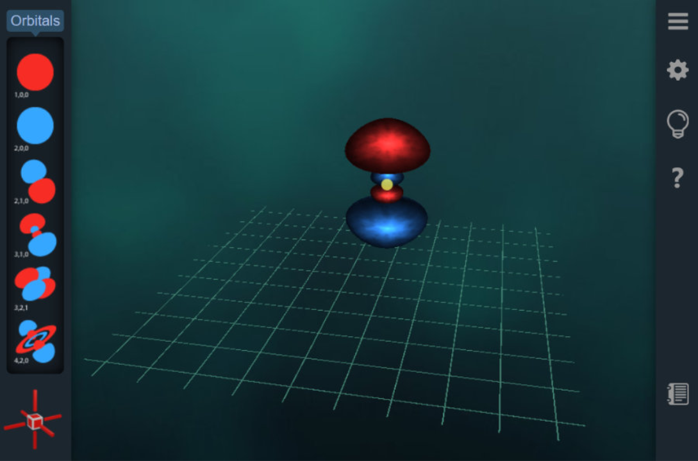
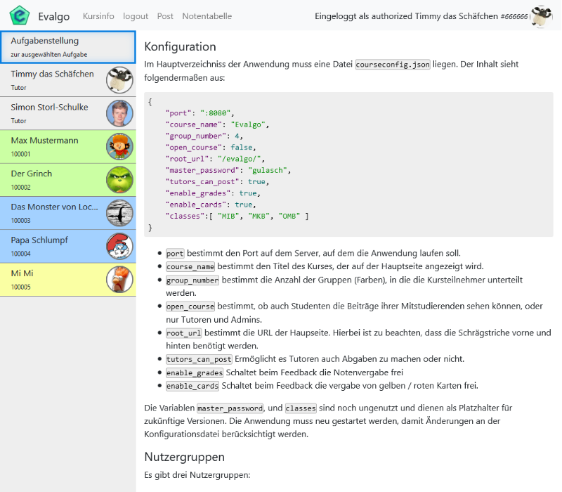
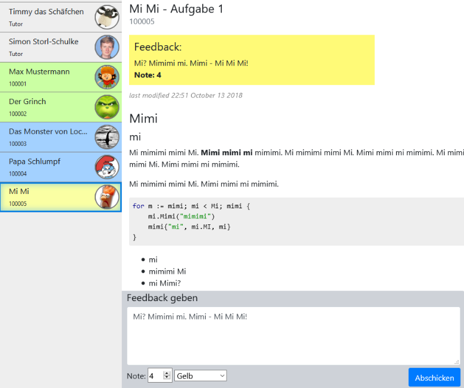
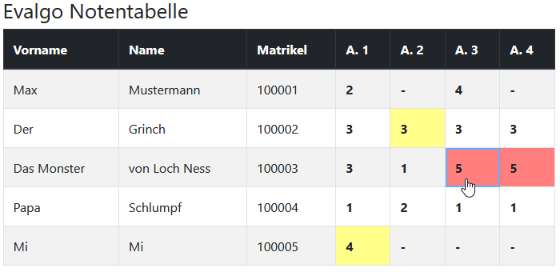
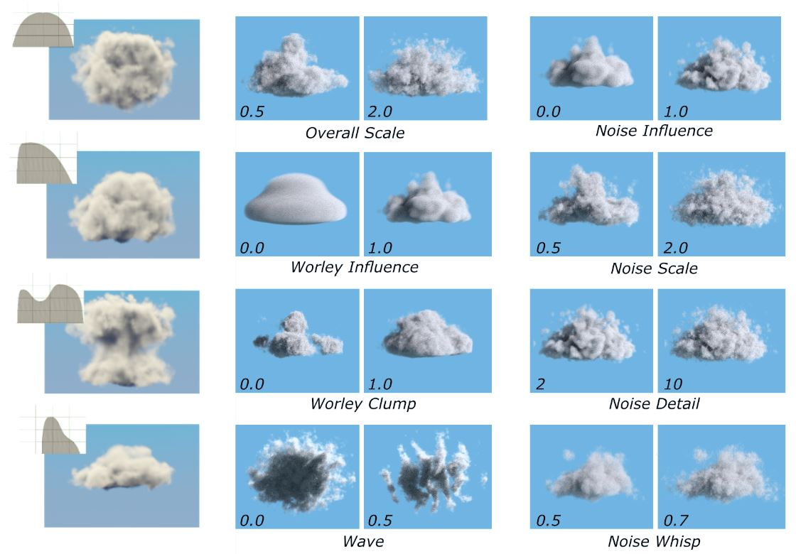
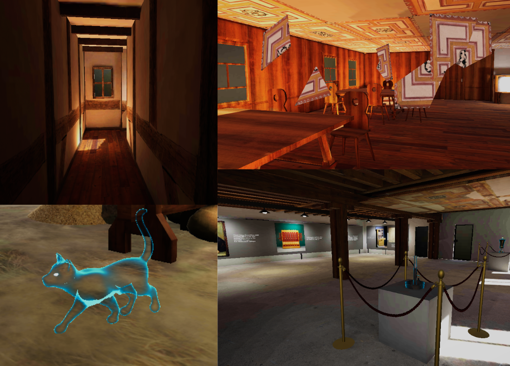
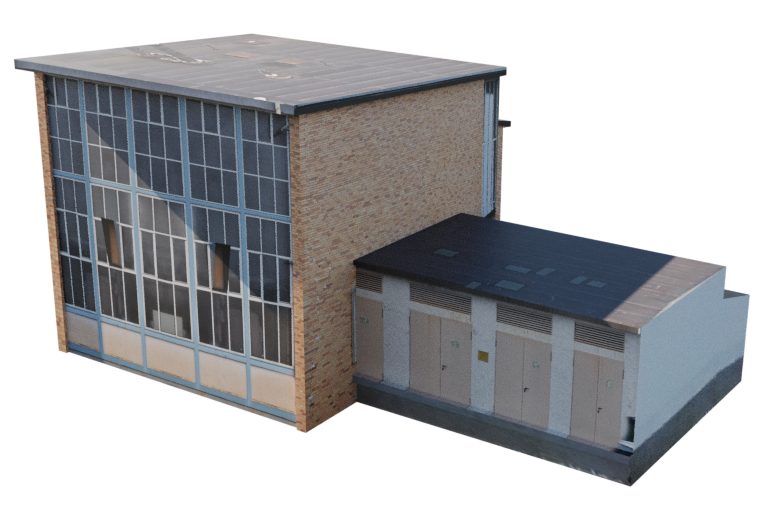
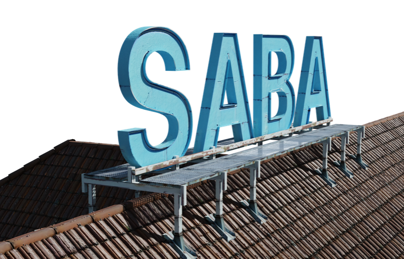
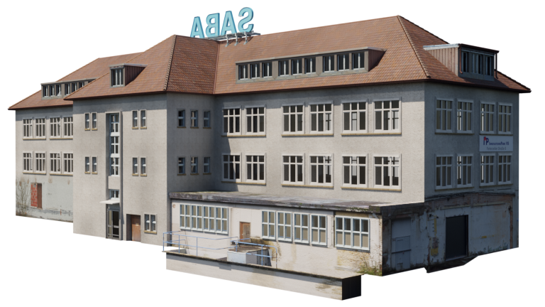

  <a href="#fudge">FUDGE</a>
  <a href="#evalgo">Evalgo</a>
  <a href="#rtcg">RTCG</a>
  <a href="#thesis">Thesis</a>
  <a href="#cat">A Cat in Time</a>
  <a href="#saba">SABA</a>

# Programmierung

<h2 id="fudge"> FUDGE <a href="https://github.com/JirkaDellOro/FUDGE"><i class="fab fa-github fa-gh"> <i class="fas fa-angle-right"></i></i></a></h2>
TypeScript, WebGL, HTML, CSS

**F**urtwangen **U**niversity **D**idactic **G**ame **E**ditor ist eine TypeScript basierte GameEngine speziell für die Lehre von Prof. Jirka Dell'Oro-Friedl. Hier arbeitete ich an der Implementierung von Meshgenerierung, OBJ-Meshimport und Shadern. Im Projekt <a href="https://github.com/hs-furtwangen/FUDGE-Chemistry_MasterW19">Chemistry with FUDGE <i class="fab fa-github fa-gh"></i></a> verwendeten wir die Engine in sehr frühen Stadium, um einen Atom-Orbital-Baukasten umzusetzen.

<h2 id="evalgo"> Evalgo <a href="https://github.com/SimonStorlSchulke/Evalgo"><i class="fab fa-github fa-gh"> <i class="fas fa-angle-right"></i></i></a></h2>

Go, HTML, CSS, JavaScript

Evalgo ist ein Kurs-Management System für Studierende und Dozenten, dass für den Kurs *Aktuelle Entwicklungen im Bereich Online-Medien* von Prof. Dirk Eisenbiegler zum Thema *Evaluation von Go für Webdevelopment* entwickelt wurde. 

  

Dozenten und Tutoren können Aufgabenstellungen verfassen und Studierende diese abgeben.

  

Zu den Abgaben können von Dozenten Feedback und Noten gegeben werden, die in einer Übersicht und Notentabelle für authorisierte Nutzer erscheinen. 

<h2 id="rtcg"> Echtzeit-Computergrafik <a href="https://github.com/SimonStorlSchulke/RealtimeCG"><i class="fab fa-github fa-gh"> <i class="fas fa-angle-right"></i></i></a></h2>

Go, OpenGL

Zum Kurs von Rainer Duda entwickelte ich hier

<h2 id="thesis"> Thesis: Wolkengenerierung <a href="res/Bachelorarbeit_Simon_Storl-Schulke.pdf"><i class="fas fa-file-pdf"></i> <i class="fas fa-angle-right"></i></i></a></h2>

OSL, Blender

In meiner Bachelorthesis beschäftigte ich mich mit der **Prozeduralen Generierung von Wolken in Offline-Renderengines**. Der Fokus lag hierbei auf Anwenderfreundlichkeit. Mithilfe weniger Parameter soll es möglich sein, komlexe Wolkenformen umzusetzen. Die Umsetzung erfolgte mit OSL (Open Shading Language).

<video width="100%" autoplay loop controls>
  <source src="res/thesis_example.mp4" type="video/mp4">
</video> 

# 3D

<h2 id="cat"> A Cat in Time</h2>

Unity, Blender

Mobilegame (Unity) für das Stadtmuseum Tübingen. Um den Geist der Katzenmumie zu retten reisen wir in das Jahr 1607. Hier war ich für 3D-Modelle und Texturierung, sowie für Musik zuständig. Der Soundtrack hat die Besonderheit, dass beim Zeitsprung die Instrumente wechseln.

*In Kooperation mit Linus Ehmann (Programmierung), Tim Marquardt (Konzept) und Olivia Storz (Design & Konzept)*

<h2 id="saba"> SABA</h2>

Blender, Meshroom




Einscannen per Drone und Nachmodellierung des alten SABA Farbikgeländes im Innovationspark Villingen in Kooperation mit Andreas Reich, Linus Ehmann und Sophie Tobisch. 

Hierbei war ich u.a. für die Nachmodellierung des SABA Hauptgebäudes anhand der eingescannten Daten und Referenzen zuständig.







